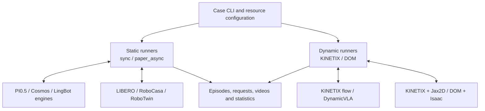

# The Speedup Paradox

[](https://arxiv.org/abs/2606.28529)
[](https://github.com/Ther-nullptr/robotics-the-speedup-paradox/actions/workflows/cpu.yml)

**English** | [中文](README.zh-CN.md)

**[The Speedup Paradox: Rethinking Inference Speed-Quality Trade-off in Embodied Tasks](https://arxiv.org/abs/2606.28529)**

Yujin Wang, Junli Chen, Yixuan Li, Shunan Dong, Huazhong Yang, Yongpan Liu, Hongyang Jia

[Paper PDF](https://arxiv.org/pdf/2606.28529) · [Citation](#citation) · [Environment setup](docs/environment_setup.en.md) · [Contributing](CONTRIBUTING.md)

Embodied inference and closed-loop evaluation code for the paper above. With a fixed model, task and scene, study how quantization, asynchronous execution and sampling steps jointly affect inference latency, task success and the number of actions needed to finish a task.

This repository is a development preview. The sections below describe the implementation on `main`; each case guide specifies its environment, resources and validation scope. Model weights and large assets are prepared separately. A license for project-owned code has not yet been selected; see [licensing and provenance](#license).

[Overview](#overview) · [Supported tasks](#cases) · [Quick start](#quickstart) · [Architecture](#architecture) · [Metrics and outputs](#metrics)

<a id="overview"></a>

## Overview

**Faster inference does not necessarily finish a task faster.** The paper introduces TISED (Task-level Inference Speedup Effect Decomposition) to analyze speed–quality trade-offs in closed-loop execution. Static tasks may require more action chunks as action quality degrades. Dynamic tasks also depend on observation freshness and object motion, and hardware latency changes these trade-offs. [Paper](https://arxiv.org/abs/2606.28529)

The repository supports four areas of experimentation:

- **Inference and lightweight execution**: separate inference engines, repository-owned model hot paths, and optional BF16 fusion, CUDA Graph, INT8/INT4 and progressive quantization.
- **Static evaluation**: per-case comparisons of synchronous execution and the paper's historical-observation abstraction, `paper_async`.
- **Dynamic evaluation**: sampling-step and virtual-latency experiments in KINETIX, plus native streaming execution in DynamicVLA + DOM.
- **Timing and statistics**: separate inference latency, control-step and task-success records, with speedups at distinct levels relative to a fixed baseline.

<a id="cases"></a>

## Supported models and tasks

Models, checkpoints, tasks and simulators are bound into **cases**. Each combination below has its own entry point and environment.

| Type | Case / run guide | Current implementation |
| --- | --- | --- |
| Static | [π0.5 + LIBERO](benchmarks/static/pi05_libero/README.md) | LeRobot/VLASH evaluator bridge; original-precision `sync` / `paper_async`; optional repository-owned model execution |
| Static | [Cosmos + LIBERO](benchmarks/static/cosmos_libero/README.md) | Separate engine and single-environment runner; `sync` / `paper_async`; optional BF16 optimizations and INT8/INT4 |
| Static | [Cosmos + RoboCasa](benchmarks/static/cosmos_robocasa/README.md) | Three-camera kitchen tasks with initialization checks; shared Cosmos optimizations and a separate task contract |
| Static | [LingBot-VA + RoboTwin](benchmarks/static/lingbot_robotwin/README.md) | Separate model worker and dual-arm simulator; `sync` / `paper_async` with delayed complete observation history |
| Dynamic | [RTC flow policy + KINETIX](benchmarks/dynamic/kinetix/README.md) | Repository-owned JAX/Flax model, KINETIX/Jax2D and 12 levels; sampling-step experiments with `coarse` / `fine` latency mapping |
| Dynamic | [DynamicVLA + DOM](benchmarks/dynamic/dynamicvla_dom/README.md) | Repository-owned model and DOM execution source; separate model/Isaac processes; native non-streaming / streaming |

Static `paper_async` and dynamic streaming use separate execution protocols. KINETIX `fine` approximates fractional delays in actuator-command space while preserving the native physics grid. DOM keeps advancing during inference and handles expired predictions through its native action queue. See the case guides for protocol details.

Optimizations are explicitly enabled within each engine's supported scope. Module coverage, hardware backends and validation limits are documented in the [inference guide](benchmarks/inference/README.md), [Cosmos quantization guide](docs/cosmos-quantization.md) and [operator guide](src/robotics_kernels/README.md).

<a id="quickstart"></a>

## Quick start

### 1. Install the CPU tools

Python 3.11 or 3.12 is recommended. These tools require no GPU, checkpoint or simulator:

```bash
git clone https://github.com/Ther-nullptr/robotics-the-speedup-paradox.git
cd robotics-the-speedup-paradox
python -m venv .venv
source .venv/bin/activate
python -m pip install -r requirements-dev.txt

python tools/validate_contracts.py --examples
python tools/compare_speedups.py --input examples/speedups/synthetic.json --markdown
python tools/embodied/trajectory_metrics.py --input tools/embodied/examples/smooth.csv
```

These examples use synthetic data. Plotting dependencies and metrics such as jerk are documented in the [trajectory tools](tools/embodied/README.md). Optionally install the repository's Python package with `python -m pip install -e .`; model and simulator stacks require separate installation.

### 2. Prepare a case environment and resources

Follow the [environment guide](docs/environment_setup.en.md) and the relevant case guide above, then fill in that entry point's `paths.env.example`. DynamicVLA + DOM and LingBot + RoboTwin use separate model and simulator environments; KINETIX uses a separate JAX environment.

For π0.5 and Cosmos, the standalone [resource preparation tool](tools/RESOURCE_PREPARATION.md) can download assets or reuse local resources. The command below only previews the plan; remove `--dry-run` to download:

```bash
python -m pip install -r tools/requirements-download.txt
python tools/prepare_resources.py --case cosmos_robocasa --dry-run
```

| Resource or artifact | Default location |
| --- | --- |
| Models and optional training data downloaded by the tool | `~/.cache/robotics/hub/`; change the resource root with `--root` or `ROBOTICS_RESOURCE_ROOT` |
| Path configuration generated by the tool | `~/.cache/robotics/env/<case>.env` |
| LIBERO assets | `~/.cache/libero/assets/` |
| RoboCasa kitchen assets | `robocasa/models/assets/` in the corresponding fork; prepared separately |
| Experiment artifacts | The explicit `--output-dir`; a directory under `runs/` is recommended |

Bind LingBot, KINETIX and DOM resources as described in their guides. Experiment entry points use offline resources. Resource preparation is separate from installing the model and simulator environments.

### 3. Run a closed-loop experiment

For Cosmos + RoboCasa with its environment and resources already prepared, start with a resource preflight:

```bash
source ~/.cache/robotics/env/cosmos_robocasa.env
bash benchmarks/static/cosmos_robocasa/run.sh \
  --task TurnOffMicrowave --episodes 1 \
  --schedule paper_async --overlap-actions 2 \
  --output-dir runs/static/cosmos_robocasa/demo-001 --dry-run
```

After preflight succeeds, remove `--dry-run` and add `--gpu 0`, selecting an idle GPU on your machine. Add `--record-video` to record complete episodes. Use a separate output directory for each new experiment.

For dynamic experiment batches, see [KINETIX sampling-step evaluation](docs/kinetix-flow-quality.md) and the [latency study workflow](docs/kinetix-latency-study.md). DOM's `--streaming`, model/simulator GPU selection and video options are covered in its [native run guide](benchmarks/dynamic/dynamicvla_dom/README.md).

<a id="architecture"></a>

## Architecture

```text
robotics-the-speedup-paradox/
├── benchmarks/
│   ├── static/                    # PI0.5/LIBERO, Cosmos/LIBERO, Cosmos/RoboCasa, LingBot/RoboTwin
│   ├── dynamic/                   # Separate KINETIX and DynamicVLA/DOM entry points
│   └── inference/                 # Complete-policy timing, numerical checks and optimization comparisons
├── src/
│   ├── robotics_bench/
│   │   ├── engines/               # Model loading, preprocessing, chunk inference and worker adapters
│   │   ├── models/                # Repository-owned PI0.5, Cosmos and DynamicVLA execution
│   │   ├── optimizations/         # Optimization switches, quantization scopes and model adapters
│   │   ├── protocols/             # Static control schedules and observation-history selection
│   │   ├── simulators/            # Static simulator adapters and lifecycle management
│   │   ├── kinetix/               # JAX policy, native environment/physics and latency protocols
│   │   ├── dynamicvla_dom/        # Native DOM scenes, server, client and action queues
│   │   ├── profiling/             # Profile processing and visualization support
│   │   └── statistics.py          # Episode statistics and failure-budget penalties
│   └── robotics_kernels/          # Separate BF16/INT operators and hardware backends
├── tools/                         # Resources, contract checks, speedups and trajectory analysis
├── schemas/                       # Shared manifest / trace contracts
├── examples/                      # Small synthetic inputs and usage examples
├── tests/                         # CPU behavior, contract and boundary checks
├── docs/                          # Environments, architecture and experiment protocols
└── .github/                       # CPU CI, issue and PR templates
```

Each case runner connects inference to its simulator. Static and dynamic schedules are maintained separately and share statistics and low-level tools. External frameworks, SDKs and simulators whose source has not been migrated remain case-specific dependencies.



Each group represents only the supported case bindings. The [architecture guide](docs/architecture.md) describes responsibilities, call paths and action lifecycles. The [operator guide](src/robotics_kernels/README.md) covers formats, loading, packing and execution layers.

<a id="metrics"></a>

## Metrics and experiment outputs

Each entry point saves configuration and resource identities, episode records, request traces, logs and optional videos. Video defaults off for static entry points and KINETIX, and on for DOM. See each case's output table and the [artifact protocol](docs/protocols/artifacts.md) for fields and timing scopes.

| Metric | Definition |
| --- | --- |
| Success rate | Successful episodes / all valid task episodes; infrastructure errors are reported separately |
| Overall control steps | Actual steps for successes, declared budget penalties for failures |
| Successful-episode mean steps / chunks | Successful episodes only; chunks use recorded inference events and zero-success means are undefined |
| Inference, chunk-cycle and task speedups | Separate ratios against a fixed baseline for the same case; measurement scopes and estimates are identified |

`paper_async` evaluates quality under each case's observation-history rules; estimated cycle time and actual host execution time are recorded separately. Complete-policy timing is covered by the [inference benchmark](benchmarks/inference/README.md), and paper-aligned definitions and examples by the [speedup protocol](docs/protocols/speedup-metrics.md).

Recompute statistics for an existing static experiment without loading a model:

```bash
python tools/summarize_experiment.py \
  --input runs/static/cosmos_robocasa/demo-001 --per-task
```

KINETIX and DOM provide their own summaries. Generated experiment data, videos, figures and reports stay in ignored `runs/` directories; machine configuration and scratch records stay in `.local/`.

<a id="citation"></a>

## Citation

If this project or paper helps your research, please cite:

```bibtex
@misc{wang2026speedupparadox,
  title         = {The Speedup Paradox: Rethinking Inference Speed-Quality Trade-off in Embodied Tasks},
  author        = {Yujin Wang and Junli Chen and Yixuan Li and Shunan Dong and Huazhong Yang and Yongpan Liu and Hongyang Jia},
  year          = {2026},
  eprint        = {2606.28529},
  archivePrefix = {arXiv},
  primaryClass  = {cs.RO},
  doi           = {10.48550/arXiv.2606.28529},
  url           = {https://arxiv.org/abs/2606.28529}
}
```

<a id="license"></a>

## Contributing, licensing and acknowledgments

Report problems through [Issues](https://github.com/Ther-nullptr/robotics-the-speedup-paradox/issues), or submit a PR following the [contribution guide](CONTRIBUTING.md). Public CI runs CPU contract and behavior checks. GPU, model-resource and simulator validation is performed separately for each case.

A license for project-owned code has not yet been selected. Third-party source retains its own terms, including the S-Lab non-commercial restriction on DynamicVLA/DOM-derived code. Weights and data have separate terms. See [THIRD_PARTY_NOTICES.md](THIRD_PARTY_NOTICES.md) and module-level `PROVENANCE.json` files for sources, versions and migration boundaries.

We thank the upstream PI0.5/OpenPI/LeRobot, VLASH, Cosmos Policy, LingBot-VA, DynamicVLA, LIBERO, RoboCasa, RoboTwin, RTC/KINETIX/Jax2D and CUTLASS projects. Their links and attribution records are collected in the notices above.
