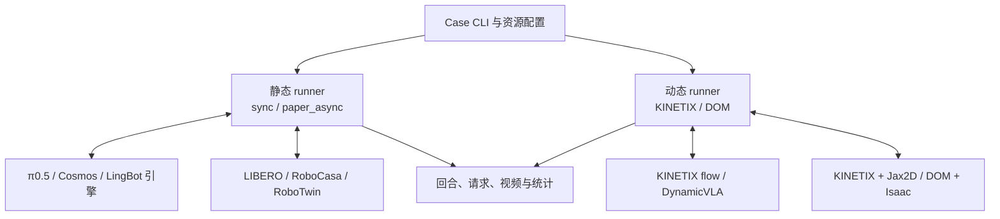

# The Speedup Paradox

[](https://arxiv.org/abs/2606.28529)
[](https://github.com/Ther-nullptr/robotics-the-speedup-paradox/actions/workflows/cpu.yml)

[English](README.md) | **中文**

**[The Speedup Paradox: Rethinking Inference Speed-Quality Trade-off in Embodied Tasks](https://arxiv.org/abs/2606.28529)**

Yujin Wang, Junli Chen, Yixuan Li, Shunan Dong, Huazhong Yang, Yongpan Liu, Hongyang Jia

[论文 PDF](https://arxiv.org/pdf/2606.28529) · [引用](#citation) · [环境配置](docs/environment_setup.md) · [贡献指南](CONTRIBUTING.md)

面向上述论文的具身模型推理与闭环评估代码库：固定模型、任务和场景，研究量化、异步执行与采样步数如何共同影响推理耗时、任务成功率和完成任务所需的动作数。

本仓处于开发预览阶段。下文列出当前 `main` 的实现范围；各 case 的环境、资源和验证边界见对应指南。模型权重和大型资产单独准备，项目自有代码的许可证尚待确定，详见[许可与来源](#license)。

[研究概览](#overview) · [支持的任务](#cases) · [快速开始](#quickstart) · [项目架构](#architecture) · [指标与输出](#metrics)

<a id="overview"></a>

## 研究概览

**更快的单次推理，未必意味着更快完成任务。** 论文提出 TISED（Task-level Inference Speedup Effect Decomposition），分析推理优化在闭环交互中的速度与质量权衡：静态任务可能因动作质量下降而需要更多动作块；动态任务则还受到观测时效与物体运动的影响，硬件延迟会改变这种权衡。[论文](https://arxiv.org/abs/2606.28529)

仓库提供四类实验能力：

- **模型推理与轻量化**：独立推理引擎、仓内模型热路径，以及可选 BF16 融合、CUDA Graph、INT8/INT4 与渐进量化。
- **静态闭环评估**：按 case 比较同步执行与论文历史观测抽象 `paper_async`。
- **动态闭环评估**：KINETIX 的采样步数与虚拟延迟实验，以及 DynamicVLA＋DOM 的原生流式执行。
- **计时与统计**：分别记录推理时间、控制步数和任务成功率，按固定 baseline 计算不同层级的加速比。

<a id="cases"></a>

## 支持的模型与任务

模型、checkpoint、任务和模拟器按 **case** 绑定；下表中的组合有各自的运行入口和环境。

| 类型 | Case / 运行指南 | 当前实现 |
| --- | --- | --- |
| 静态 | [π0.5＋LIBERO](benchmarks/static/pi05_libero/README.md) | LeRobot/VLASH evaluator 桥接；原精度 `sync` / `paper_async`；可选仓内模型执行路径 |
| 静态 | [Cosmos＋LIBERO](benchmarks/static/cosmos_libero/README.md) | 独立引擎与单环境 runner；`sync` / `paper_async`；可选 BF16 优化、INT8/INT4 |
| 静态 | [Cosmos＋RoboCasa](benchmarks/static/cosmos_robocasa/README.md) | 三相机、厨房任务与初态核对；共享 Cosmos 优化，保留独立任务契约 |
| 静态 | [LingBot-VA＋RoboTwin](benchmarks/static/lingbot_robotwin/README.md) | 独立模型 worker 与双臂模拟器；`sync` / `paper_async`，延迟完整观测历史 |
| 动态 | [RTC flow policy＋KINETIX](benchmarks/dynamic/kinetix/README.md) | 仓内 JAX/Flax 模型、KINETIX/Jax2D、12 个关卡；采样步数与 `coarse` / `fine` 延迟映射 |
| 动态 | [DynamicVLA＋DOM](benchmarks/dynamic/dynamicvla_dom/README.md) | 仓内模型与 DOM 执行源码；独立模型/Isaac 进程；原生 non-streaming / streaming |

静态 `paper_async` 和动态 streaming 使用各自的执行协议。KINETIX 的 `fine` 在执行器指令域近似分数延迟，保留原生物理网格；DOM 在推理期间持续推进，并由原生动作队列处理过期预测。协议细节见各 case 指南。

优化按引擎支持范围显式启用。具体模块、硬件后端和验证范围见[推理优化入口](benchmarks/inference/README.md)、[Cosmos 量化指南](docs/cosmos-quantization.md)及[算子说明](src/robotics_kernels/README.md)。

<a id="quickstart"></a>

## 快速开始

### 1. 安装 CPU 工具

推荐 Python 3.11 或 3.12；这些工具无需 GPU、checkpoint 或模拟器：

```bash
git clone https://github.com/Ther-nullptr/robotics-the-speedup-paradox.git
cd robotics-the-speedup-paradox
python -m venv .venv
source .venv/bin/activate
python -m pip install -r requirements-dev.txt

python tools/validate_contracts.py --examples
python tools/compare_speedups.py --input examples/speedups/synthetic.json --markdown
python tools/embodied/trajectory_metrics.py --input tools/embodied/examples/smooth.csv
```

以上示例使用合成数据。轨迹绘图依赖和 jerk 等指标的说明见[轨迹分析工具](tools/embodied/README.md)。可选 `python -m pip install -e .` 安装本仓 Python 包；各模型和模拟器运行栈需另行安装。

### 2. 准备 case 环境与资源

按[环境指南](docs/environment_setup.md)和上表对应 case 的说明配置独立环境，并填写该入口的 `paths.env.example`。DynamicVLA＋DOM 和 LingBot＋RoboTwin 分别配置模型与模拟器环境；KINETIX 使用独立 JAX 环境。

π0.5 与 Cosmos 可使用独立的[资源准备工具](tools/RESOURCE_PREPARATION.md)下载或复用本地资源。以下命令仅预览；确认后移除 `--dry-run` 执行下载：

```bash
python -m pip install -r tools/requirements-download.txt
python tools/prepare_resources.py --case cosmos_robocasa --dry-run
```

| 资源或产物 | 默认位置 |
| --- | --- |
| 工具下载的模型与可选训练数据 | `~/.cache/robotics/hub/`；通过 `--root` 或 `ROBOTICS_RESOURCE_ROOT` 调整资源根目录 |
| 工具生成的路径配置 | `~/.cache/robotics/env/<case>.env` |
| LIBERO 资产 | `~/.cache/libero/assets/` |
| RoboCasa 厨房资产 | 对应 fork 的 `robocasa/models/assets/`，单独准备 |
| 实验产物 | 命令显式指定的 `--output-dir`，建议置于 `runs/` |

LingBot、KINETIX 和 DOM 按各自指南绑定资源。实验入口使用离线资源；资源下载完成后，仍需完成对应模型和模拟器的环境安装。

### 3. 启动闭环实验

以环境和资源已准备好的 Cosmos＋RoboCasa 为例，先做资源预检：

```bash
source ~/.cache/robotics/env/cosmos_robocasa.env
bash benchmarks/static/cosmos_robocasa/run.sh \
  --task TurnOffMicrowave --episodes 1 \
  --schedule paper_async --overlap-actions 2 \
  --output-dir runs/static/cosmos_robocasa/demo-001 --dry-run
```

预检通过后，去掉 `--dry-run`，添加 `--gpu 0` 选择本机空闲 GPU；添加 `--record-video` 录制完整回合。每次新实验使用独立输出目录。

批量动态实验见 [KINETIX 采样步数评估](docs/kinetix-flow-quality.md)和[延迟实验工作流](docs/kinetix-latency-study.md)。DOM 的 `--streaming`、模型/模拟器 GPU 和视频开关见[原生运行指南](benchmarks/dynamic/dynamicvla_dom/README.md)。

<a id="architecture"></a>

## 项目架构

```text
robotics-the-speedup-paradox/
├── benchmarks/
│   ├── static/                    # π0.5/LIBERO、Cosmos/LIBERO、Cosmos/RoboCasa、LingBot/RoboTwin
│   ├── dynamic/                   # KINETIX 与 DynamicVLA/DOM 的独立入口
│   └── inference/                 # 完整 policy 计时、数值对齐与优化对照
├── src/
│   ├── robotics_bench/
│   │   ├── engines/               # 模型加载、预处理、动作块推理及 worker 适配
│   │   ├── models/                # 仓内 π0.5、Cosmos、DynamicVLA 执行源码
│   │   ├── optimizations/         # 优化开关、量化范围及模型适配
│   │   ├── protocols/             # 静态控制调度与历史观测选择
│   │   ├── simulators/            # 静态模拟器适配和生命周期
│   │   ├── kinetix/               # JAX policy、原生环境/物理与延迟协议
│   │   ├── dynamicvla_dom/        # DOM 原生场景、服务端、客户端与动作队列
│   │   ├── profiling/             # profile 数据处理与可视化支持
│   │   └── statistics.py          # 回合统计与失败预算惩罚
│   └── robotics_kernels/          # 独立 BF16、INT 算子及硬件后端
├── tools/                         # 资源准备、契约校验、加速比与轨迹分析
├── schemas/                       # 通用 manifest / trace 数据契约
├── examples/                      # 小型合成输入与使用示例
├── tests/                         # CPU 行为、契约与边界检查
├── docs/                          # 环境、架构与实验协议
└── .github/                       # CPU CI、Issue 和 PR 模板
```

模型推理和模拟器通过各自的 case runner 连接。静态与动态调度分别维护，共享统计和底层工具；外部框架、SDK 与未迁入的模拟器仍按各 case 配置。



各分组只代表已绑定 case 的集合。详细职责、调用链和动作生命周期见[架构指南](docs/architecture.md)；算子的格式、加载、打包与执行分层见[算子系统](src/robotics_kernels/README.md)。

<a id="metrics"></a>

## 指标与实验输出

每次运行按入口保存配置与资源身份、逐回合记录、请求轨迹、日志和可选视频。静态入口与 KINETIX 的视频默认关闭，DOM 默认开启。产物字段与时间范围见各 case 的输出表及[产物协议](docs/protocols/artifacts.md)。

| 指标 | 口径 |
| --- | --- |
| 成功率 | 成功回合数 / 全部有效任务回合数；基础设施异常单独报告 |
| 全体控制步数 | 成功回合计实际步数，失败回合按声明预算惩罚 |
| 成功回合平均步数 / chunk | 仅以成功回合为分母；chunk 使用有记录的推理事件，零成功时为空 |
| 推理、动作块周期、任务加速比 | 分别相对同一 case 的固定 baseline 计算；测量范围与估计值单独声明 |

`paper_async` 按 case 的历史观测规则评估质量，其周期估计与实际宿主运行时间分别记录。完整 policy 推理计时见[推理 benchmark](benchmarks/inference/README.md)，论文口径与计算示例见[加速比协议](docs/protocols/speedup-metrics.md)。

已有静态实验可直接重新统计，无需加载模型：

```bash
python tools/summarize_experiment.py \
  --input runs/static/cosmos_robocasa/demo-001 --per-task
```

KINETIX 和 DOM 使用各自入口提供的汇总。生成的实验数据、视频、图表和报告保存在被忽略的 `runs/`；本机配置与临时记录放在 `.local/`。

<a id="citation"></a>

## 引用

如果本项目或论文对你的研究有帮助，请引用：

```bibtex
@misc{wang2026speedupparadox,
  title         = {The Speedup Paradox: Rethinking Inference Speed-Quality Trade-off in Embodied Tasks},
  author        = {Yujin Wang and Junli Chen and Yixuan Li and Shunan Dong and Huazhong Yang and Yongpan Liu and Hongyang Jia},
  year          = {2026},
  eprint        = {2606.28529},
  archivePrefix = {arXiv},
  primaryClass  = {cs.RO},
  doi           = {10.48550/arXiv.2606.28529},
  url           = {https://arxiv.org/abs/2606.28529}
}
```

<a id="license"></a>

## 贡献、许可与致谢

欢迎通过 [Issues](https://github.com/Ther-nullptr/robotics-the-speedup-paradox/issues) 反馈问题，或按[贡献指南](CONTRIBUTING.md)提交 PR。公共 CI 运行 CPU 契约和行为检查；GPU、模型资源与模拟器验收按具体 case 单独完成。

本项目自有代码的许可证尚未确定。第三方源码保留各自许可，其中 DynamicVLA/DOM 派生代码受 S-Lab 非商业条款约束；权重与数据的许可分别适用。来源、版本和移植边界见 [THIRD_PARTY_NOTICES.md](THIRD_PARTY_NOTICES.md) 及各模块的 `PROVENANCE.json`。

感谢 π0.5/OpenPI/LeRobot、VLASH、Cosmos Policy、LingBot-VA、DynamicVLA、LIBERO、RoboCasa、RoboTwin、RTC/KINETIX/Jax2D 和 CUTLASS 等上游项目；项目链接与归属记录见上述来源说明。
