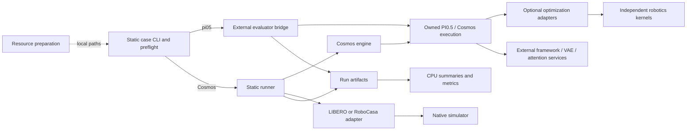
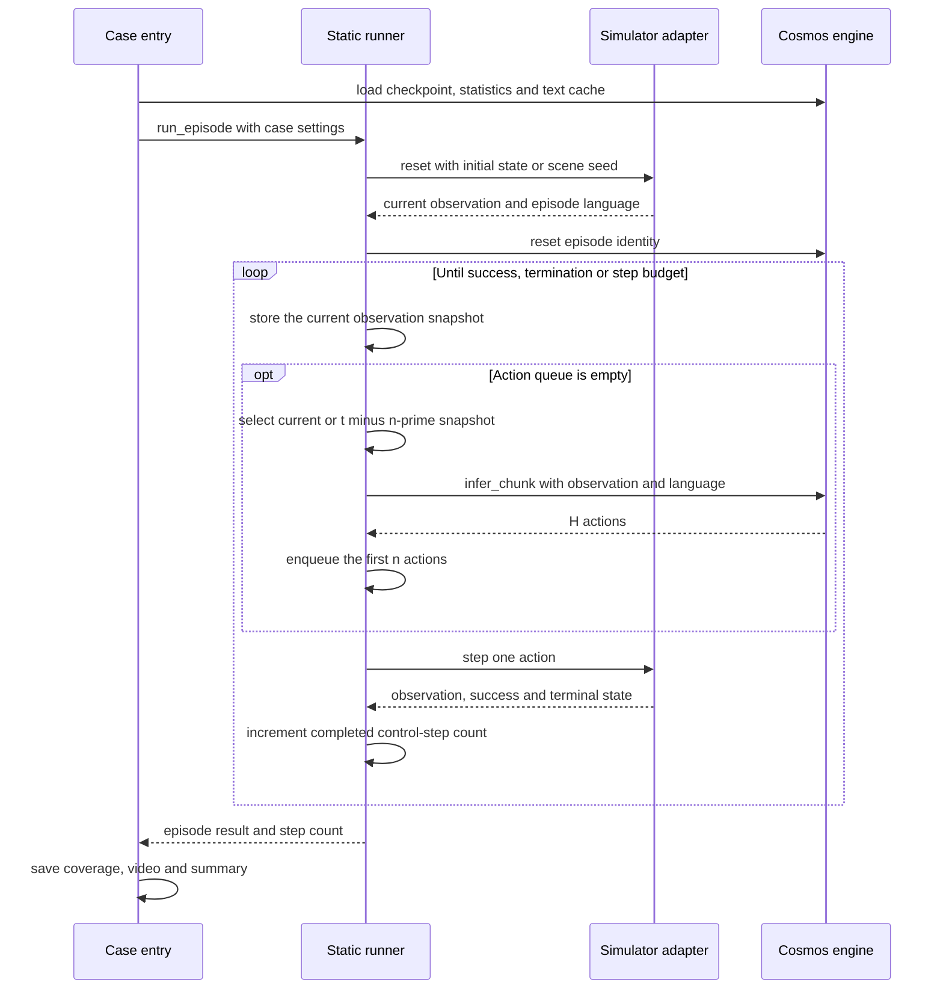

# 代码架构与执行流程

[项目首页](../README.md) · [环境配置](environment_setup.md) · [协作流程](../CONTRIBUTING.md)

本页描述已经存在的代码。当前运行路径包括π0.5＋LIBERO外部评测桥接，以及Cosmos＋LIBERO、Cosmos＋RoboCasa原生单环境执行。模型主要执行路径已迁入本仓，支持独立融合开关和INT4/INT8后端；量化全量任务质量尚待验证。动态任务与通用模型服务仍属于后续方向。

[LingBot＋RoboTwin](../benchmarks/static/lingbot_robotwin/README.md) 使用独立模型worker和本机WebSocket，另有 `lingbot_runner.py` 保留执行后更新KV/VAE缓存的原生节奏。其 `paper_async` 将每个缓存关键帧k的观测移到max(0,k−n′)，推理边界t的最新可见观测为t−n′；原始预测动作条件保持原位。它不走Cosmos的无状态动作块循环。

## 1. 以case组织实验

每个case明确绑定模型、checkpoint、预处理、任务、模拟器版本和控制协议。静态与动态任务分开维护，模型与模拟器不展开笛卡尔积。Cosmos两个case复用引擎代码，但分别使用自己的权重、统计量、输入相机、动作块长度和运行环境。

| case | 模型调用 | 环境与执行 | 状态 |
| --- | --- | --- | --- |
| `pi05_libero` | 外部evaluator调用本仓PI0.5执行代码；可显式选native参考 | 本仓桥接、初态适配、加载/覆盖审计 | 原始基线object同步/异步各500回合；新优化仅固定输入和单回合验证 |
| `cosmos_libero` | 本仓 `CosmosEngine(suite="libero")` | 原生LIBERO adapter＋共享静态runner | 可运行；固定输入对齐和单回合GPU验证 |
| `cosmos_robocasa` | 本仓 `CosmosEngine(suite="robocasa")` | 原生RoboCasa adapter＋共享静态runner | 可运行；固定场景同步/异步GPU验证 |
| `lingbot_robotwin` | 外部LingBot模型worker＋本仓客户端 | RoboTwin双臂控制与sync/paper_async观测/cache更新循环 | 验证范围见case说明 |
| DynamicVLA＋DOM、Kinetix | 待接入 | 各自保留任务与执行协议 | 规划中 |

## 2. 当前模块关系

实线表示运行调用或结果传递；虚线表示预先准备的配置输入。

资源下载在实验前独立执行。checkpoint、公共框架和模拟器来自显式提供的外部资源，CPU工具顶层不导入Torch或模拟器。π0.5保留外部evaluator执行闭环，但默认policy及PaliGemma/Gemma/SigLIP执行本仓源码。Cosmos先由兼容原生loader加载和审计权重，再绑定本仓policy/sampler/DiT类；VAE和attention库仍为外部依赖。两者可用 `--model-runtime native` 选择未加本仓优化的参考路径。

## 3. 文件职责与阅读顺序

| 文件或目录 | 职责 |
| --- | --- |
| [资源工具](../tools/prepare_resources.py) | 下载计划、本地复用、版本和文件检查、生成env配置 |
| [π0.5入口](../benchmarks/static/pi05_libero/run.py) | 参数解析、AST/文件预检、来源记录、调用外部evaluator |
| [π0.5环境适配](../benchmarks/static/pi05_libero/libero_adapter.py) | 指定初态、reset顺序和终止后的行为 |
| [π0.5评估审计](../benchmarks/static/pi05_libero/evaluation_audit.py) | 读取真实任务/初态ID，记录和核对episode覆盖 |
| [Cosmos LIBERO入口](../benchmarks/static/cosmos_libero/run.py) / [配置](../benchmarks/static/cosmos_libero/config.py) | 单环境运行生命周期、任务分配、CPU预检及报告 |
| [Cosmos RoboCasa入口](../benchmarks/static/cosmos_robocasa/run.py) / [配置](../benchmarks/static/cosmos_robocasa/config.py) | 固定任务/场景清单、初始化保存和reference比对 |
| [Cosmos引擎](../src/robotics_bench/engines/cosmos.py) | 原生模型加载、统计量和T5、图像预处理、动作块推理 |
| [Cosmos加载审计](../src/robotics_bench/engines/cosmos_load_guard.py) | 检查实际权重加载覆盖；限定允许的元数据兼容项 |
| [模型执行代码](../src/robotics_bench/models/) | PI0.5和Cosmos主要forward；各目录记录原始来源哈希 |
| [优化适配](../src/robotics_bench/optimizations/) / [算子](../src/robotics_kernels/README.md) | 实例范围开关、BF16融合、图缓存和显式低精度后端 |
| [推理实验](../benchmarks/inference/README.md) / [profile导出](../src/robotics_bench/profiling/) | 完整policy调用计时、数值比较、实测ledger和逐轮图表 |
| [LIBERO adapter](../src/robotics_bench/simulators/libero.py) | 任务初态、环境reset/step、成功与渲染 |
| [RoboCasa adapter](../src/robotics_bench/simulators/robocasa.py) | 场景初始化、动态语言、三相机、控制器动作映射 |
| [静态runner](../src/robotics_bench/protocols/static_runner.py) | 历史快照、请求触发、执行动作前缀、计数与终止 |
| [视频记录器](../benchmarks/static/pi05_libero/video_recorder.py) | 三个case复用的完整episode录像和元数据 |
| [统计核心](../tools/episode_statistics.py) / [汇总入口](../tools/summarize_experiment.py) | 失败预算、仅成功统计、任务加权、结果输出 |
| [加速比工具](../tools/compare_speedups.py) / [轨迹工具](../tools/embodied/README.md) | 声明时间域下的baseline比较、轨迹及导数指标 |

建议先读选定case的README与配置，再看入口、engine/simulator，最后读runner和统计工具。RoboCasa入口目前复用Cosmos LIBERO入口中的日志与汇总辅助函数；这属于已存在的代码依赖，还没有独立抽成通用runtime包。

## 4. Cosmos的episode生命周期

- LIBERO使用任务内的指定初态；RoboCasa按任务、layout/style和环境种子创建场景。两者的settling都在策略控制计数之外。
- RoboCasa在reset后读取本回合语言，不能提前把任务名当成固定指令。模型缓存保留在CPU，当前指令必须有对应T5 embedding。
- `H` 是模型输出长度，`n` 是每次实际执行的前缀长度：LIBERO为H=16、默认n=16，RoboCasa为H=32、默认n=16。
- checkpoint加载不完整、初始化比对失败或环境异常会使运行报错，不伪装成任务失败episode。

模型实例的权重和文本缓存跨episode保留；runner的动作队列与观测历史在每次episode重建。模拟器负责成功与终止，runner负责计数及调度。第三方模型的预处理、采样与动作归一化保留在engine边界内。

## 5. 论文异步与时间口径

`paper_async` 在控制步t选择t−n′的历史观测；三相机/双相机与proprio同时延迟，历史不足使用当前观测。它改变模型看到的快照，当前实现没有后台推理线程，也不按墙钟推理耗时额外推进环境。

[论文异步契约](../benchmarks/static/pi05_libero/paper_async.py) 与 [加速比口径](protocols/speedup-metrics.md) 定义周期估计。`Tinf` 必须来自相同模型/配置的推理测量；宿主评估耗时和episode步数不能替代它。仿真控制步长、视频播放FPS、声明的动作时间分别记录。

同步和异步都可输出动作步数及成功率。总体步数统计对失败使用显式预算惩罚，成功仅统计自身动作数；仅成功均值以成功episode数为分母。口径见 [统计定义](protocols/speedup-metrics.md#8-控制步数统计与实验汇总)。

## 6. 配置、结果与契约的边界

`run.sh` 选择case解释器；CLI解析资源与实验参数，`--dry-run` 只做CPU预检；真实运行后写出manifest、加载审计、episode记录和汇总。RoboCasa还保存初始物理状态、场景XML及观测指纹，`--reference-run` 用于核对对照起点。

[schemas](../schemas/README.md) 定义通用manifest/trace契约。当前case使用自己的运行manifest格式及episode/request记录，不能直接把这些文件称为通用v1逐动作trace；格式边界见 [产物协议](protocols/artifacts.md)。同一统计工具可以消费多个case的episode ledger。

[环境指南](environment_setup.md) 说明资源与输出位置。日志、视频、checkpoint、下载缓存、个人研究资料都不进入Git；公共文档不依赖某台机器的绝对路径。

## 7. 优化与测量边界

优化默认关闭，通过重复 `--enable` 独立选择；精度由 `--precision` 和 `--quant-scope` 指定。INT4/INT8采用真实CUTLASS整数Tensor Core，融合准备、打包与必要转换均计入调用耗时。FP4/FP8保留独立Blackwell源码，尚未完成目标硬件验证。

图与缓存属于模型实例，要求串行调用且上下文内权重不变；变化的输入在每次调用刷新。PI0.5的缺失相机缓存只复用固定placeholder编码，不复用真实图像。关闭上下文会恢复原方法与模块。

每轮重新测无优化BF16锚点，低精度再对照共享优化相同的BF16。计时从准备好的CPU观测到CPU动作块，加载、编译、图捕获与warmup单列；模拟器与控制周期另行统计。profile单独采集，GPU事件时长之和不替代墙钟延迟。固定输入逐值一致与任务成功率分开记录，变慢和数值失败的候选也保留在历史图中。

## 8. 后续扩展位置

- 新模型接入匹配case的模型或engine边界；新增低精度实现接入优化适配层，验证动作质量、真实backend和完整推理代价。
- 新模拟器实现reset/step、观测、成功、渲染和控制时间；必要的模拟器内部改动放独立fork，并固定来源版本。
- 动态DOM和Kinetix保留各自控制协议。Kinetix采用原生JAX状态、PRNG和rollout，不要求经过Torch或VLA动作块接口。
- 只有真实调用方需要时才抽取通用服务/RPC或独立包；当前不存在 `src/streaming_infra/`，本仓算子位于 `src/robotics_kernels/`。

代码与协议变更遵循 [贡献流程](../CONTRIBUTING.md)。更多图稿见 [架构图目录](diagrams/README.md)，其中后续设计均单独标明状态。
