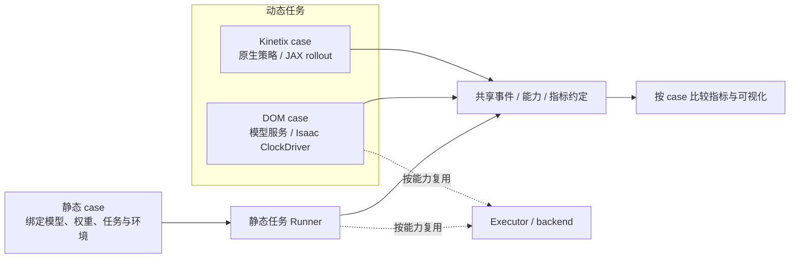

# 模块与复用边界

[架构图源码与生成说明](diagrams/README.md) 覆盖总体模块、异步时序、推理内部路径和双仓 PR 流程；SVG/HTML 在本地按需生成。

当前已有CPU契约/分析工具、开发协议和静态/动态任务入口说明。下面的 runtime 和 adapter 路径是后续模块边界，按任务逐步创建，不以空目录或空类表示模型已支持。

先在同一仓库维护公共核心与机器人调用方，避免新成员同时协调多个仓库。后续其他项目通过固定版本/SHA 依赖公共核心；第二个真实调用方出现后再决定是否独立拆包。

## 静态与动态任务分开组织

实验入口是明确的 case：绑定模型、checkpoint、预后处理、任务、模拟器版本和执行协议，再选择该 case 支持的优化方案。模型与模拟器不自动生成笛卡尔积；接口形状兼容不足以证明权重、控制语义或任务能力兼容。

| 实验路径 | 当前规划范围 | 路径内固定的内容 |
| --- | --- | --- |
| [静态任务入口](../benchmarks/static/README.md) | π0.5＋LIBERO；Cosmos-Policy＋LIBERO或其适配的RoboCasa任务；LingBot-VA的任务组合待确认 | 各case的任务匹配权重、观测/action处理、控制循环和baseline |
| [动态任务入口](../benchmarks/dynamic/README.md) | DynamicVLA＋DOM；[Kinetix原生JAX策略与环境](../benchmarks/dynamic/kinetix/README.md) | 各case独立的policy/控制循环、时延与世界推进、动作有效期、成功判据和baseline |

以上均为接入规划。分类依据是具体任务及实验假设，不把某个模拟器永久归为静态或动态。静态任务也可比较同步/异步，动态任务也需要同步baseline；任务类型、调度方式和推理等待期间是否推进世界分别声明。固定输入的模型计时是独立验证环节，不代替任一路径的闭环实验。

两条路径共享事件记录、指标定义与能力约定，推理executor和backend/量化机制按执行能力复用，各case拥有控制循环与协议实现。DOM的时钟驱动和过期动作规则按动态case接入，静态任务不必依赖这些组件。同模型跨case复用经过验证的Engine，但不自动共享checkpoint、processor、历史状态或benchmark结果。

动态路径内DOM与Kinetix也分开：DOM保留模型服务和Isaac时钟驱动；Kinetix保留原生JAX/Flax策略、PyTree状态、PRNG、可选recurrent carry及编译rollout。Kinetix不需要机械臂观测、文本条件或动作块，也不强制经过进程Executor。公共接口不能把VLA或Torch的实现细节变成所有case的前提。

任务专用启动代码和配置分别归属两个benchmark目录；VLA控制实现按需放 `src/robotics_bench/protocols/static/`、`dynamic/`。模型/环境adapter按其自身边界管理；Kinetix首次实现先在自己的case目录保留原生policy/env/rollout组合。固定输入的kernel/policy测量作为共享验证环节，按实际需求抽取代码，避免复制底层工具。

```text
src/streaming_infra/        通用 contracts、runtime、backend、quantization、trace
src/robotics_bench/         policies、simulators、protocols、experiments、visualization
csrc/                      已实际接入的 C++ / CUDA 算子
schemas/                   manifest 与事件格式
examples/                  当前契约样例，之后增加 CPU 调度样例
tests/                     当前校验测试，之后增加 runtime/backend/integration
benchmarks/static/         已有case入口说明；静态任务运行代码/配置随接入增加
benchmarks/dynamic/        已有case入口说明；动态任务运行代码/配置随接入增加
  kinetix/                 已有原生JAX接入边界；策略、环境与rollout仍待实现
docs/tasks/README.md       长期工作方向；具体任务与交接放在 Issue / PR
docs/templates/            可复制到 Issue / PR 的任务与交接模板
```

## 单向依赖



公共核心不得 import `robotics_bench` 或模拟器，也不得依赖任何兄弟目录。顶层 import 不加载 GPU/模型/模拟器。未来初版可用一个 distribution 提供两个 namespace，模型/GPU/模拟器放可选依赖，待真实需求推动拆包。

需要修改第三方模拟器内部源码时，采用独立 fork 与固定提交依赖，主仓保留 adapter、调度和实验配置。引入方式、版本与跨仓 PR 见 [模拟器依赖协议](protocols/simulator-dependencies.md)。

## 责任划分

| 模块 | 对外约定 | 不能隐式承担 |
| --- | --- | --- |
| PolicyAdapter | 输入/输出与状态约定；VLA按动作块，Kinetix按原生动作分布/carry；明确就绪及reset | env.step、延迟注入、私自覆盖新旧动作队列 |
| SimulatorAdapter | observe、step、reset、terminal、render、clock/tick | 调模型、等推理、决定未来动作何时可用 |
| ProtocolRunner / native rollout | 按case选择控制实现；采样、触发、释放、队列、过期与终止 | 模型 mask/normalization/cache 细节；强制所有后端使用host循环 |
| Backend | capability、prepare、dispatch、输出生命周期、fallback 原因 | 无记录地改精度或宣称不支持形状已加速 |
| Trace/metrics | ID 关联、时间域、记录、失败预算和聚合 | 改变环境步进或控制命令 |
| Viewer | 从 trace 还原状态、时间轴、观测年龄和欠载 | 从渲染 FPS 猜控制频率；阻塞推理/控制主循环 |

观测输入保持不可变直到请求真正完成。可复用 buffer 必须有 ownership 与 lifetime；terminal 立即结束逻辑 episode，在途计算 drain 后再释放资源。不同模型的 KV、prompt、denoise、RoPE 与 action normalization 留在 adapter，先用实际实现证明共性再抽象。

## 三类变更分开提交

接口/协议变化先给可观察例子与 schema 兼容说明；基础模型接入先给固定输入动作对齐；性能优化再给实际 kernel、数值与端到端证据。允许它们形成一串依赖 PR，避免一次修改既改变控制协议又换精度，使结果无法归因。

优化的目标是满足质量门槛时降低完整 inference/任务代价。GEMM 占比、kernel 数、copy 数用来诊断瓶颈。加载期 pack/concat、shared quant、norm/activation/epilogue 融合、workspace/cache 优化都由 profile 选择，不要求每个模型套用相同路线。

模型未来分别报告 `reference` 和优化 backend，原始与新协议也分别命名。没有实测的配置明确标注未验证，不把支持列表当作性能结果。
