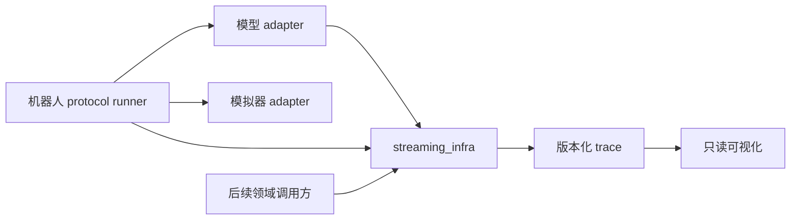

# 模块与复用边界

当前只有契约校验工具与开发协议。下面的 runtime 和 adapter 路径是后续模块边界，按任务逐步创建，不以空目录或空类表示模型已支持。

先在同一仓库维护公共核心与机器人调用方，避免新成员同时协调多个仓库。后续其他项目通过固定版本/SHA 依赖公共核心；第二个真实调用方出现后再决定是否独立拆包。

```text
src/streaming_infra/        通用 contracts、runtime、backend、quantization、trace
src/robotics_bench/         policies、simulators、protocols、experiments、visualization
csrc/                      已实际接入的 C++ / CUDA 算子
schemas/                   manifest 与事件格式
examples/                  当前契约样例，之后增加 CPU 调度样例
tests/                     当前校验测试，之后增加 runtime/backend/integration
benchmarks/                之后增加 kernel、policy、closed-loop 的分层测量
docs/tasks/                有 owner、范围、依赖和验收的任务卡
docs/handoffs/              跨成员、跨 AI 会话的接力记录
```

## 单向依赖



公共核心不得 import `robotics_bench` 或模拟器，也不得依赖任何兄弟目录。顶层 import 不加载 GPU/模型/模拟器。未来初版可用一个 distribution 提供两个 namespace，模型/GPU/模拟器放可选依赖，待真实需求推动拆包。

## 责任划分

| 模块 | 对外约定 | 不能隐式承担 |
| --- | --- | --- |
| PolicyAdapter | 输入快照、请求、完成句柄、动作 chunk、reset | env.step、延迟注入、私自覆盖新旧动作队列 |
| SimulatorAdapter | observe、step、reset、terminal、render、clock/tick | 调模型、等推理、决定未来动作何时可用 |
| ProtocolRunner | 采样、触发、释放、队列、过期与终止 | 模型 mask/normalization/cache 细节 |
| Backend | capability、prepare、dispatch、输出生命周期、fallback 原因 | 无记录地改精度或宣称不支持形状已加速 |
| Trace/metrics | ID 关联、时间域、记录、失败预算和聚合 | 改变环境步进或控制命令 |
| Viewer | 从 trace 还原状态、时间轴、观测年龄和欠载 | 从渲染 FPS 猜控制频率；阻塞推理/控制主循环 |

观测输入保持不可变直到请求真正完成。可复用 buffer 必须有 ownership 与 lifetime；terminal 立即结束逻辑 episode，在途计算 drain 后再释放资源。不同模型的 KV、prompt、denoise、RoPE 与 action normalization 留在 adapter，先用实际实现证明共性再抽象。

## 三类变更分开提交

接口/协议变化先给可观察例子与 schema 兼容说明；基础模型接入先给固定输入动作对齐；性能优化再给实际 kernel、数值与端到端证据。允许它们形成一串依赖 PR，避免一次修改既改变控制协议又换精度，使结果无法归因。

优化的目标是满足质量门槛时降低完整 inference/任务代价。GEMM 占比、kernel 数、copy 数用来诊断瓶颈。加载期 pack/concat、shared quant、norm/activation/epilogue 融合、workspace/cache 优化都由 profile 选择，不要求每个模型套用相同路线。

模型未来分别报告 `reference` 和优化 backend，原始与新协议也分别命名。没有实测的配置明确标注未验证，不把支持列表当作性能结果。
