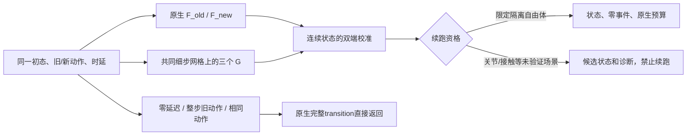

# KINETIX原生端点与细步差分校准

这是独立研究原型，入口为`benchmarks/dynamic/kinetix/research_calibration.py`，核心在`src/robotics_bench/kinetix/calibration.py`。生产native-blend和已有细分默认值没有改动。

当前确认了原生端点严格恢复、隔离自由体的局部时延响应，以及一种内部网格跳变的缓解方法。**尚未实现可用于关节/接触任务完整回合的校准引擎，也不是细步物理等价证明。**

## 校准定义

每次探针跨越一个原生环境tick：`C=1/30 s`，包含两个原生物理步`H=1/60 s`；辅助细步默认`h=H/2`。外层动作带为10 Hz，三个原生tick保持同一命令。

从相同完整起始状态，分别计算：

- `F_old`、`F_new`：整个C一直执行旧/新动作的原生完整transition。
- `G_old`、`G_new`、`G_switch`：旧/新常量动作及实际时延切换对应的三条辅助细步轨迹。

所有G使用相同的时间网格。辅助模型统一清除起始冲量缓存并关闭warm-start，因此它是显式不同的辅助数值模型。原生F不清缓存，也不改变编译边界。没有读取原版未来轨迹或复制录像状态；F和G都是从当前输入状态重新计算的反事实。

最初的单端公式为：

`P_one = F_new + (G_switch - G_new)`

它在零延迟端成立，但不保证整步延迟端恢复`F_old`。令`lambda=delay/C`，双端公式改为：

`P_two = (1-lambda)*F_new + lambda*F_old + G_switch - ((1-lambda)*G_new + lambda*G_old)`

加减只作用于活动刚体的位置、速度、旋转、角速度；平移/旋转分别按逆质量/逆惯量掩码处理。使用原生保存的未取模2D角度。连续校准在NumPy float64中计算，允许续跑的结果再转回原生float32；接触关系、历史冲量、reward/done不参与线性加减。



## 两种辅助细步模型

`--fine-model split`在真实动作切换时刻插入额外物理步，G的三个对照使用同一分割。每个正时长段确实执行物理求解；零padding由`lax.cond`跳过。它避免把请求时延直接取整，但段数变化仍会改变约束求解。

`--fine-model impulse-blend`保持固定h网格。每个小步在该G自己的当前状态分别计算新旧电机冲量，按动作在小步内的占用时间混合；thruster命令按其线性关系混合。权重0/1直接选择原端值。每个h仍执行重力、驱动、接触、约束和积分，但**小步内动作切换是冲量平均近似，不是精确事件积分**。固定网格移除了“额外一次极短求解”这个来源，不保证接触/限位响应全局连续。

float32实现拒绝小于1 ns的正分割段及非零端点偏移，不默默当成零padding。这个限制不代表状态具有1 ns分辨率。

## 返回与续跑边界

`ResidualCalibrator.probe(..., audit=False)`在零延迟、整步旧动作或processed动作相同时，直接调用原生step并返回完整结果。这是严格兼容分支，不能把其逐值一致当作G的物理等价证据。`audit=True`还会计算反事实，用于检查两个公式。

一般机器人混合动作探针只返回`proposal`和诊断：`transition=None`，`require_transition()`抛出异常。`fine_sampled_rewards`仅来自辅助G，不是校准后任务的reward或done。

首版续跑仅限以下隔离域：

- 单个活动动态刚体，无其它活动碰撞体、地板、墙和活动关节；最多一个活动thruster且连接该刚体。
- factor=2、frame_skip=2，输入冲量缓存为零。
- 所有分支及候选末态未发现接触；基于重力、最大驱动力和力臂的整个C运动界限排除中途clipping。
- 候选及最终float32状态有限、未越界；不通过静默裁剪修补结果。

运动检查使用保守的速度上界`|v0|_inf + a_bound*C`，位置上界`|q0|_inf + C*v_bound`及相应角速度上界，并保留浮点裕量。刷新thruster派生坐标、保持无事件reward=0，timestep只增加一次C，done按原生预算判断。这解决了一个实际反例：物体先碰到数值位置上限、随后回到范围内，末态检查却错误放行。修复前GPU已复现，修复后被拒绝。

## 已测结果与限制

使用本机既有10 Hz动作带，Car Launch 71 tick、Walker 256 tick。零延迟、整步旧动作、相同动作三种路径的完整状态、观测、reward/done分别与原生执行逐值一致；这些结果来自原生兼容分支。

隔离单自由体测试使用恒定中心驱动力：

- 单端公式在整步旧动作端残留约`0.0013890266` world units位移，双端公式为0。
- 16个时延点的速度与解析冲量响应最大绝对误差约`2.62e-8` world units/s。
- 带非零时延的30 tick、1秒隔离自由体续跑完成；强反向力造成中途clipping的回归用例被拒绝。
- 位置校准保留原生离散积分偏差，不能由速度验收推导连续位移精度改善。

两关各两个原生快照、每快照16个时延探针，比较内部边界`h=8.333333 ms`与`h+epsilon`。下表为初态探针、epsilon=10 ns时，候选状态的最大单刚体位置差：

| 任务 | 插入切换小步 split | 固定网格 impulse-blend |
| --- | ---: | ---: |
| car_launch | 2.0071e-4 | 3.1720e-9 |
| mjc_walker | 4.2862e-4 | 8.9701e-8 |

split在epsilon从1微秒缩到10纳秒时仍呈固定量级偏差；固定网格在这些采样点显著降低了该现象。这是float64候选状态的局部对照，不是所有边界连续性的证明，也不意味着原生float32具有表中最小差值的分辨率。每种模型的64个机器人探针中，56个混合动作探针均保持不可续跑；8个端点探针返回原生完整结果。

下一阶段应先解决约束兼容状态、冲量缓存传递和校准事件重建，再讨论真实任务长回合。当前不输出校准任务成功率、端到端加速比，也不将两个原生预算截断相等视为自然终止对齐。

## 运行

使用KINETIX独立Python环境和已有研究动作带，不下载checkpoint或数据。

```bash
"$ROBOTICS_KINETIX_PYTHON" -B benchmarks/dynamic/kinetix/research_calibration.py \
  --fine-model impulse-blend --snapshot-ticks 0,12 \
  --boundary-eps-ms 0.001,0.0001,0.00001 \
  --action-tape-root runs/dynamic/kinetix/control-10hz-videos \
  --gpu 0 --output-dir runs/dynamic/kinetix/calibration-blend-001

# Repeat with --fine-model split and a separate output directory for comparison.
"$ROBOTICS_KINETIX_PYTHON" -B benchmarks/dynamic/kinetix/plot_calibration.py \
  --run-dir runs/dynamic/kinetix/calibration-blend-001 \
  --compare-run runs/dynamic/kinetix/calibration-split-001
```

`--action-tape-root`下应有`car_launch/`和`mjc_walker/`，各含相应动作NPY及声明10 Hz的manifest；工具检查每3个原生tick保持同一动作。`--toy-only`无需动作带。输出manifest、每个探针的NPZ、PNG/SVG/PDF曲线和绘图摘要，均留在忽略的运行目录。详尽探针数据是局部状态响应，不是延迟闭环评估。
