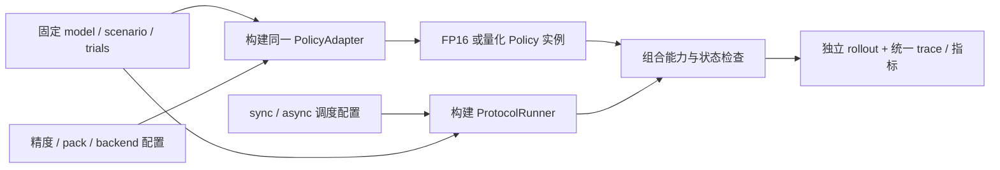

# 同模型、同任务下的组合轻量化实验

本文件定义实验组织方式。当前没有模型构建器、量化运行时或调度器；示例是待实现的配置/接口设计，不能直接交给现有 manifest v1 校验器运行。

把一次运行定义为：**固定实验案例 + 模型变换/执行配置 + 调度策略 + 时间/延迟模式**。量化改变 policy 的数值与执行路径；异步改变请求、动作和环境推进的组织方式。二者可以组合，但不能用同一个 `apply(model)` 接口混合处理。

静态任务与动态任务分别组织case和baseline。一个case预先绑定模型、checkpoint、processor、任务、模拟器及允许的协议；本文的组合发生在该case支持的优化轴内，不枚举模型与模拟器的笛卡尔积。新增后端或模型不自动建立跨任务兼容性。

## 1. 先固定实验案例

| 固定项 | 需要保存的内容 |
| --- | --- |
| 基础模型 | 架构、同源 checkpoint hash、adapter、processor版本/hash、预处理/action normalization |
| 任务场景 | simulator及依赖版本、任务定义、资产、初始状态集合、外部扰动 |
| 执行语义 | control/physics dt、预测 horizon、实际执行长度、采样/接管/欠载规则 |
| 生成参数 | denoise/refinement steps、基础采样策略；不与量化一起隐式改变 |
| 预算与判据 | 相同任务预算及时间域、成功/失败/timeout定义 |
| 硬件条件 | 设备、功耗/频率、软件、资源共部署、计时边界、warmup与采样方法 |
| 随机输入 | 初始场景、环境随机流、policy噪声、延迟随机流；各自独立记录 |

“同一模型”在此表示相同架构与共同基础 checkpoint。量化后的 packed 权重是派生产物，需有自己的 hash、校准和量化配置，不应伪装成字节完全相同的权重。校准/调参数据与最终评估试验分开，不能用测试结果反复选择量化参数后仍报告为独立评估。

“同一场景”表示相同任务、初态、环境规律和可比的随机输入。闭环动作不同会导致后续观测/轨迹不同，这是实验结果。逐步强制给各策略同一份录制观测属于离线 replay，不能用它替代闭环实验。

## 2. 量化与异步使用两个独立配置轴

| 配置轴 | 作用位置 | 例子 |
| --- | --- | --- |
| 模型精度/变换 | 加载、校准/pack、算子映射、backend | FP16、W8A8、W4A16；具体层与scale显式列出 |
| 调度策略 | ProtocolRunner / executor / action queue | sync、async；触发时刻、在途请求、接管/过期规则 |
| 时间与延迟 | world clock / delay provider | 固定外生延迟、实际profile重放、实测墙钟 |

调度轴中的 sync 指推理与动作的启动/执行关系；世界在等待期间暂停还是继续演化，是独立的 `world_progression`。比较四组时固定它。例如动态比较中同步等待新动作时，世界仍按声明的 hold 控制推进；不能只让异步组的世界运动。

静态任务可采用async，动态任务可采用sync。静态任务仍可进行在线闭环和正常物理演化，不等于离线forward或冻结世界。

异步策略的重规划间隔、overlap深度、预测horizon和实际执行动作数也分别命名。可以有意扫描这些参数，但不能都藏在一个 `async=True` 中。

## 3. 第一轮采用2×2实验矩阵

以下矩阵适用于一个同时支持这些精度和调度变体的case。未实现或不兼容的变体显式标记，不为了填满矩阵更换模型、任务或权重。静态、动态case各自比较，使用相同指标定义并不意味着共用同一个baseline分母或直接合并任务时间。

| run | 精度/执行路径 | 调度 | 回答的问题 |
| --- | --- | --- | --- |
| F-S | 同源FP16 baseline | 同步 | 基准 |
| Q-S | 指定量化变体 | 同步 | 量化在同步条件下的效果 |
| F-A | 同一个FP16变体 | 指定异步策略 | 异步在FP16条件下的效果 |
| Q-A | 同一个量化变体 | 同一异步策略参数 | 二者组合及交互作用 |

先比较 Q-S/F-S、F-A/F-S；再比较 Q-A/F-A（异步下量化效果）及 Q-A/Q-S（量化后异步效果）。最后把所有配置按成功率、任务代价和资源限制共同评估。

主表统一相对F-S baseline计算；其他配对关系另标增量效果。论文定义的推理、动作块周期与任务加速比及计算工具见 [统一加速比协议](speedup-metrics.md)。

如果异步已将推理完全隐藏在旧动作执行窗口中，继续量化可能减少 GPU 工作量，却不缩短动作交接时间。因此组合收益既不能简单相加，也不能把两个 speedup 相乘。

外围fusion、compiler flags及backend也要记录。如果量化仅能通过另一个backend执行，Q-S/F-S测得的是“量化＋后端变化”的部署效果；要隔离位宽影响，需要同后端的浮点对照或补充backend消融。针对某个精度专用的norm+quant融合可成为该方案的一部分，另以消融解释其贡献。

## 4. 代码如何组合



接口伪代码如下，函数名是设计示意，当前并不存在：

```python
policy = build_policy(shared_case.model, precision_config)
runner = build_runner(schedule_config, shared_case.world, delay_config)
validate_combination(policy, runner)
result = runner.run(policy, shared_case.scenario, shared_case.trials)
```

PolicyAdapter 的 observation→action 契约不因量化而改变。量化只替换符合精度计划的内部执行路径；async runner通过worker/完成句柄组织同一个policy，保留输出可消费时刻、输入快照和episode来源。

上面的worker/action-queue示意适用于对应VLA case。Kinetix保留 [原生policy与JAX rollout](../../benchmarks/dynamic/kinetix/README.md)，在自己的执行路径验证优化；公共配置轴不强制它使用Torch量化kernel、进程worker或动作块。异步设备派发与编译批量执行不自动等同于模型/环境重叠，不兼容的优化组合标记为不支持。

每个实验变体独立构建或从干净状态恢复，不把同一个已被原地量化的模型接着当FP16 baseline；不在四组间共享可写KV、workspace、queue或随机数发生器。单实例非线程安全时限制一个在途请求或做实例隔离。

组合检查应确认真实kernel能力、形状/精度、模型状态生命周期、simulator推进模式及buffer ownership。配置了W8A8但实际回退FP16时要显式失败，或在预先允许的混合配置里记录fallback层与耗时，不能无声归为成功量化运行。

## 5. 配置应怎样写

下面只展示结构；引用ID尚未绑定实际模型、校准集或设备，不是可执行配置：

```yaml
experiment:
  shared_case: pi05_libero_case_v1
  # 此case包含同源checkpoint、任务/初态、设备、控制周期、预算与随机流

policy_variants:
  fp16:
    transform: none
    execution_profile: fp16_backend_v1
  w8a8:
    transform: quantize
    precision_plan: w8a8_layers_v1
    calibration: calibration_set_v1
    execution_profile: w8a8_backend_v1

schedulers:
  sync:
    mode: sync
  async:
    mode: async
    trigger: remaining_actions
    trigger_value: 2
    max_inflight: 1
    handover: finish_current_chunk

matrix:
  policy_variant: [fp16, w8a8]
  scheduler: [sync, async]
```

`shared_case` 还必须包含共同的过期/欠载语义，policy variants导出实际层map与kernel，delay配置为每个组合绑定明确来源。有效执行长度不足以使用触发值2时，组合检查应拒绝。加入新精度或新调度时扩展配置，不复制四份模型代码或四份rollout脚本。

## 6. 分清两种延迟实验

**机制对照：** 给精度变体施加相同外生延迟，或在固定观测/噪声fixture上比较数值，观察量化误差和调度策略各自的影响。这种设置用于解释机制，不能拿人工固定延迟宣称实际部署加速。离线固定观测只用于policy一致性/误差检查。

**部署对照：** 使用各个有效执行配置的真实耗时。量化可能通过减少推理时间降低观测年龄，进而影响SR；这也是部署效果的一部分，但不能全归因于数值变化。async的基础推理耗时可能不变，收益体现在重叠、等待和动作节拍。

切换精度、fusion、shape、steps或backend后重新建立profile，不能继续用FP16的profile模拟量化设备延迟。异步与仿真/渲染共占设备时还要验证共部署耗时；离线独占GPU profile不自动代表共部署延迟。虚拟重放与实际计算时间避免双算，规则见 [仿真协议](simulation.md)。

第一轮固定async参数比较；如果随后为每个精度分别调优overlap/触发点，应作为另一轮“各自调优后”的结果，保存调参预算与独立验证集，不能与固定参数矩阵混为单因素比较。

## 7. 指标和更复杂的方法

统一输出实际精度/backend/fallback、policy p50/p95、动作发布间隔、observation age、队列欠载/过期、峰值内存，以及全部试验的SR、失败/timeout和固定预算代价。成功条件任务时间和共同成功seed的比较作为补充，不替代全部试验结果。

环境、policy噪声、延迟采样使用分开的随机流。保存seed/初态清单和实际请求/动作序列；仅设置相同全局seed不能保证异步调用顺序消耗相同随机数，更不能保证相同轨迹。

普通async属于执行策略，不需要改基础模型参数。FAAC等学习式纠正、QAT或模型蒸馏还涉及训练和派生权重，应新增模型/训练因素，设置对应训练基线并记录checkpoint lineage。它们可以继续与量化和调度组合，但不能宣称只改了一个运行时开关。实现时在 Issue/PR 说明训练方法与派生权重，保留公开论文/源码来源。

## 8. 在当前项目中落地

后续按三个小PR推进：首先定义shared case、policy variant和scheduler的配置及组合校验；然后接一个真实模型的FP16/量化backend；最后用已验证的CPU调度语义接sync/async并跑矩阵。当前协议优先，不要求先复现论文。

现有manifest v1不包含完整checkpoint/量化/组合元数据，需通过 [契约演进](artifacts.md) 增加相应格式，先用合成计划测试“共享项保持不变、非法组合拒绝、四个组合各有独立run ID”，再接真实实验。图和伪代码不表示这些执行功能已实现。
