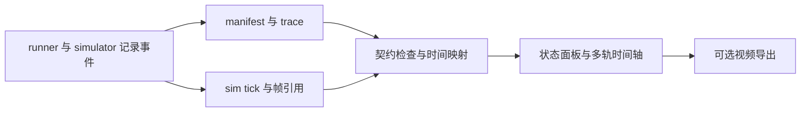

# 仿真状态与推理时间轴展示协议

当前是 viewer 的实施规范，尚未实现界面。第一版使用合成 trace 即可开发；模型和论文视频无需先复现。对应任务：[020 Trace viewer](../tasks/020-trace-viewer.md)。

## 推荐布局

参考 [OxyGen 的演示](https://github.com/air-embodied-brain/OxyGen#demo)：左右并排比较，显示当前阶段、环境画面、辅助任务状态、推理累计时间、模拟时间和当前帧。其视频显式区分推理暂停环境与 simulator 执行动作，展示思路可借鉴；本项目增加严格的时间域与事件来源，避免把视频节奏当作动力学证据。

每个 run 的面板包括：

- 顶部：任务、运行模式、当前阶段，以及 synthetic / measured 标识。
- 环境：按 sim tick 关联的帧，显示观测采样时刻和实际正在执行的 chunk。
- 状态：待处理请求、输入观测、完成/释放、队列长度、action index、过期/欠载原因。
- 底部：可选择的时间轴、任务预算、模型耗时、模拟时长与终止结果。

文本记忆等辅助任务不是首版必需；有真实事件后再显示 generating/complete/cancelled，不能按视频帧数合成不存在的 token 到达时间。只有完成文本时，就只展示完整文本与完成事件。

## 时间轴来源必须可见

| 展示轴 | 定义 | 用途与限制 |
| --- | --- | --- |
| host measured | 同域 host event 实测时间 | 包含实际运行中的计算/等待，不能跨机器直接相减 |
| simulation | simulator 的逻辑 tick/时间 | 表示动力学推进，不代表 GPU 实际计算时间 |
| composed presentation | 串行协议下将实测推理片段与模拟执行片段拼接 | 静态演示可用，显式标“重建展示时间”；不冒充完整 wall-clock trace |

例如静态串行协议中推理 80 ms、执行动作 50 ms，可以展示 130 ms 的交替周期，推理段保持同一环境帧。若真实动态协议要求推理时世界继续运动，不能靠复制静止帧得到正确画面；必须由 simulator 在这 80 ms 推进并记录状态。异步协议的重叠片段不可直接把 inference 与 execution 时长相加，应该在共同时间轴画多条轨道。

视频 FPS 与 control Hz 分开：编码 25 FPS 不表示控制 25 Hz。画面采样/重复/插值规则、settling frames、是否包含 warmup、是否变速和是否裁剪都进入展示元数据。左右比较固定同一种时间基准和速度，不按各自完成比例拉伸视频制造快慢差异。

## 数据流

v1 schema 尚无图像引用、per-token progress、cache 状态或 presentation metadata 字段；正式增加这些字段前先走契约变更。初版 UI 使用当前事件字段展示状态，有无帧状态即可，不能往严格 schema 任意塞新属性。

## 运行开销与验收

离线渲染从持久化 artifact 读取。以后实时订阅通过有界队列/独立进程，慢消费者丢显示帧并计数；关键事件单独保留，不能在控制线程同步压缩视频或画图。正式 benchmark 对比开启/关闭 tracing 的开销。

验收包括：点动作可追踪来源观测；完成但未释放的结果不会画为可执行；终止后晚回调只画诊断；cross-clock age 不显示伪数字；有重叠时不双算时长；无视频帧时明确显示缺失。截图检查布局，事件断言检查语义，两者分别记录。
